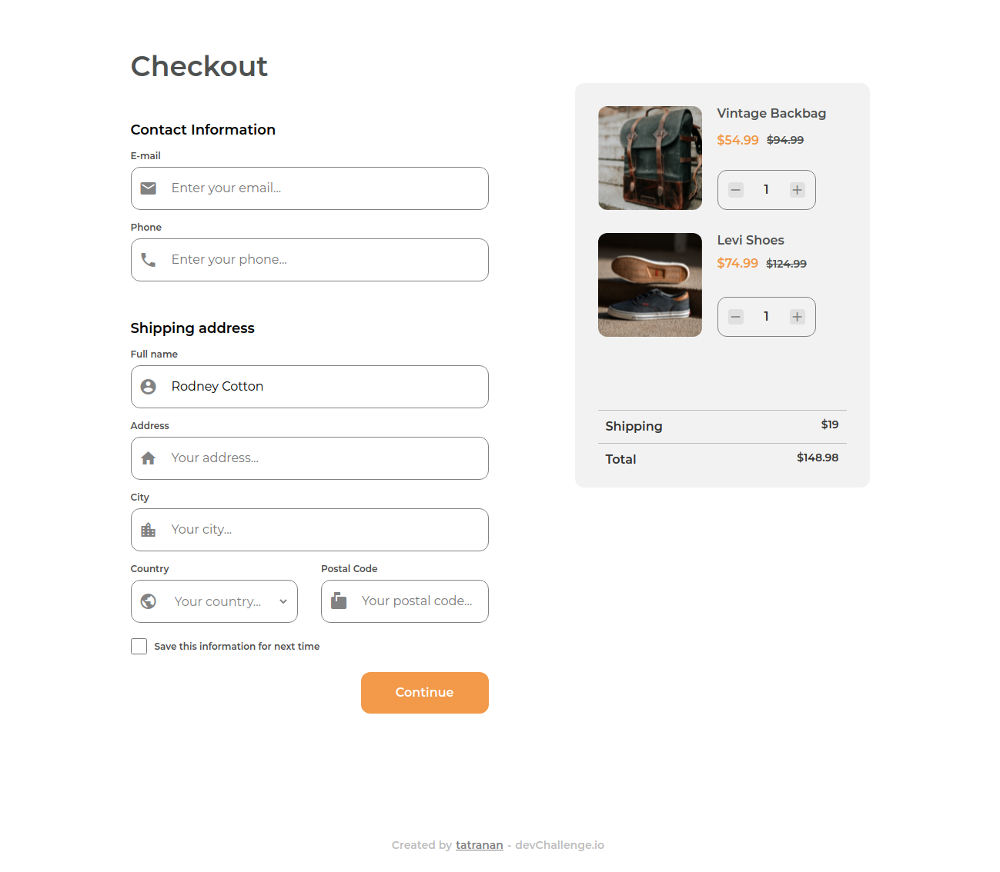

<!-- Please update value in the {}  -->

<h1 align="center">Checkout Page</h1>

   Solution for a challenge from  <a href="http://devchallenges.io" target="_blank">Devchallenges.io</a>.

  <h3>
    <a href="https://tatranan.github.io/CheckoutPage-DevChallenge/">
      Demo
    </a>
     | 
    <a href="https://github.com/tatranan/CheckoutPage-DevChallenge">
      Solution
    </a>
     | 
    <a href="https://devchallenges.io/challenges/0J1NxxGhOUYVqihwegfO">
      Challenge
    </a>
  </h3>

<!-- TABLE OF CONTENTS -->

## Table of Contents

- [Overview](#overview)
  - [Built With](#built-with)
- [Features](#features)
- [Contact](#contact)
- [Acknowledgements](#acknowledgements)

<!-- OVERVIEW -->

## Overview

- Where can I see your demo?
- What was your experience?
- What have you learned/improved?
- Your wisdom? :)

### Built With

<!-- This section should list any major frameworks that you built your project using. Here are a few examples.-->

- [CSS](https://reactjs.org/)

## Features

<!-- List the features of your application or follow the template. Don't share the figma file here :) -->

This application/site was created as a submission to a [DevChallenges](https://devchallenges.io/challenges) challenge. The [challenge](https://devchallenges.io/challenges/0J1NxxGhOUYVqihwegfO) was to build an application to complete the given user stories.

- [ ] User story: I can see a page following the given design
- [x] User story: I can input email, phone, full name, address, city, country, and postal code
- [x] User story: I can input the number of items
- [x] User story: I can select at least 3 countries from the dropdown
- [ ] User story: When I click submit button or press enter, I can see a warning if validation fails
- [ ] User story: When I click submit button or press enter, I can see a successful alert if validation succeeds
- [ ] Addition:Validate Field
- [ ] Addition:Update Quantity
- [ ] Addition:Show modal after validation succeeds

## Acknowledgements

<!-- This section should list any articles or add-ons/plugins that helps you to complete the project. This is optional but it will help you in the future. For exmpale -->

- [Steps to replicate a design with only HTML and CSS](https://devchallenges-blogs.web.app/how-to-replicate-design/)
- [Node.js](https://nodejs.org/)
- [Marked - a markdown parser](https://github.com/chjj/marked)

## Contact

- Website [your-website.com](https://{your-web-site-link})
- GitHub [@your-username](https://{github.com/your-usermame})
- Twitter [@your-twitter](https://{twitter.com/your-username})
